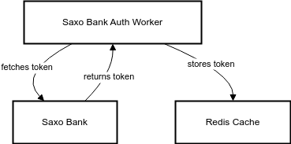

# Saxo Bank API Auth Worker

A small worker that authenticates with the Saxo Bank API and retrieves an
access token, which is then stored in a Redis database.

This worker is designed to be run as a background service.

## Prerequisites

- Redis server running on `localhost:6379`
- Python 3.12
- UV
- Saxo Bank Account with API access

## How it works

1. The worker starts and connects to the Redis server.
2. It retrieves the oauth info from `saxoapp.json`.
3. It authenticates with the Saxo Bank API using the provided credentials.
4. It retrieves an access token and stores it in the Redis database.
5. The worker runs indefinitely, refreshing the token 10 seconds before expiry.

